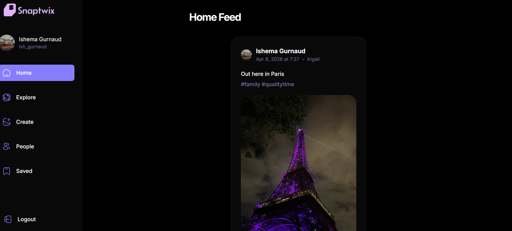

  

# SnapTwix 📸
 
> A modern, full-stack social media platform where people connect, share moments, and discover content — built for the general public.
 
## 📸 Screenshots

| Home Feed | Profile Page | Saved | 
|---|---|---|
|  |  |  | 
 
---
 
## 🌍 What Is SnapTwix?
 
SnapTwix is a full-featured social media application inspired by platforms like **Instagram** and **Twitter**. It allows users to create accounts, share posts, interact with content through likes and saves, follow other users, and discover new people — all wrapped in a fast, responsive, and modern UI.
 
Whether you're a casual user sharing life moments or someone building a following, SnapTwix gives you the tools to do it.
 
---
 
## ✨ Features
 
### 🔐 Authentication
- Secure **sign up and sign in** with email and password
- Persistent sessions — stay logged in across visits
- Protected routes — unauthenticated users are redirected to login
- Powered by **Appwrite Authentication**
 
### 🏠 Home Feed
- Dynamic feed showing posts from people you follow
- Real-time updates as new posts are created
- Infinite scroll for seamless content browsing
- Similar to how **Instagram's home feed** surfaces relevant content
 
### 📝 Posts
- Create posts with images and captions
- Edit or delete your own posts
- View full post detail pages
- Posts are stored and served via **Appwrite Storage & Database**
 
### ❤️ Likes & Saves
- Like any post with a single tap — just like **Twitter/X hearts**
- Save posts to revisit later — similar to **Instagram's bookmark** feature
- Like and save counts update in real time
 
### 👥 Follow & Unfollow
- Follow any user to see their posts in your feed
- Unfollow at any time
- Follower and following counts shown on every profile
- Designed around the same social graph model used by **Instagram and TikTok**
 
### 🔍 Search & Explore
- Search for users by name or username
- Explore page to discover new content and trending posts
- Similar to **Instagram's Explore tab**
 
### 👤 User Profiles
- Fully featured profile pages showing:
  - Profile photo, name, bio
  - Follower and following counts
  - All posts by that user
- Edit your own profile at any time
- Inspired by **Instagram and Twitter profile pages**
 
---
 
## 🛠️ Tech Stack
 
| Layer | Technology | Real World Equivalent |
|---|---|---|
| **Frontend** | React + TypeScript | Used by Meta, Airbnb |
| **Routing** | React Router v6 | Industry standard SPA routing |
| **State & Data Fetching** | TanStack React Query | Used by major SaaS products |
| **Styling** | Tailwind CSS | Used by Vercel, GitHub |
| **Backend** | Appwrite (BaaS) | Similar to Firebase by Google |
| **Database** | Appwrite Database | SQL document storage |
| **File Storage** | Appwrite Storage | Similar to AWS S3 |
| **Authentication** | Appwrite Auth | Similar to Auth0 / Firebase Auth |
| **Build Tool** | Vite | Next-gen frontend tooling |
 

---
 
## 🚀 Getting Started
 
### Prerequisites
 
Make sure you have the following installed:
- [Node.js](https://nodejs.org/) v18 or higher
- [npm](https://www.npmjs.com/) or [yarn](https://yarnpkg.com/)
- An [Appwrite](https://appwrite.io/) account and project set up
 
### 1. Clone the Repository
 
```bash
git clone https://github.com/ishemagurnaud0-maker/SnapTwix.git
cd SnapTwix
```
 
### 2. Install Dependencies
 
```bash
npm install
```
 
### 3. Set Up Environment Variables
 
Create a `.env` file in the root of the project:
 
```env
VITE_APPWRITE_URL=https://cloud.appwrite.io/v1
VITE_APPWRITE_PROJECT_ID=your_project_id
VITE_APPWRITE_DATABASE_ID=your_database_id
VITE_APPWRITE_STORAGE_ID=your_storage_id
VITE_APPWRITE_USERS_COLLECTION_ID=your_users_collection_id
VITE_APPWRITE_POSTS_COLLECTION_ID=your_posts_collection_id
```
 
> ⚠️ Never commit your `.env` file to version control.
 
### 4. Run the Development Server
 
```bash
npm run dev
```
 
The app will be available at `http://localhost:5173`
 
### 5. Build for Production
 
```bash
npm run build
```
 
---
 
## 🔄 Core App Flow
 
```
User opens SnapTwix
        │
        ▼
   Authenticated?
   ┌─────┴─────┐
  YES          NO
   │            │
   ▼            ▼
 Home Feed    Sign In / Sign Up Page
   │
   ├── Browse posts from people you follow
   ├── Like, save, or comment on posts
   ├── Visit a profile → Follow / Unfollow
   ├── Search & Explore new content
   └── Create your own posts
```
 
---
 
## ⚙️ Key Implementation Patterns
 
### Data Fetching with React Query
All server state is managed with **TanStack React Query** — the same pattern used in enterprise-grade applications. Every API call has a corresponding `useQuery` or `useMutation` hook, keeping components clean and free from fetch logic.
 
### Optimistic UI Updates
After actions like liking or following, `invalidateQueries` is used to mark stale cache and trigger automatic refetches — ensuring the UI always reflects the true state of the database without a manual page refresh.
 
### Protected Routes
All main app pages are wrapped in an `AuthGuard` component that checks for an active session. Unauthenticated users are immediately redirected to the sign-in page — the same pattern used by platforms like **Notion** and **Figma**.
 
### Image Handling
Images are uploaded directly to **Appwrite Storage** and served via CDN-backed URLs — similar to how **Instagram** uses object storage for media files.
 
---
 
## 🔐 Environment & Security
 
- All sensitive configuration lives in `.env` and is never hardcoded
- Appwrite handles password hashing, session tokens, and auth security
- Database permissions are configured at the collection level in Appwrite Console — only authenticated users can read/write data
 
---
 
## 🛣️ Roadmap
 
- [ ] Comments on posts
- [ ] Notifications system
- [ ] Direct messaging
- [ ] Stories feature
- [ ] Dark / Light mode toggle
- [ ] Post analytics for creators
- [ ] Mobile app (React Native)
 
---
 
## 🤝 Contributing
 
Contributions are welcome! To get started:
 
1. Fork the repository
2. Create a new branch: `git checkout -b feature/your-feature-name`
3. Make your changes and commit: `git commit -m "Add your feature"`
4. Push to your branch: `git push origin feature/your-feature-name`
5. Open a Pull Request
 
---
 
## 📄 License
 
This project is licensed under the **MIT License** — see the [LICENSE](LICENSE) file for details.
 
---
 
## 👨‍💻 Author
 
Built with inspiration by **[Ishema Gurnaud]**
 
- GitHub: [@ishemagurnaud0-maker](https://github.com/ishemagurnaud0-maker)
-
 
---
 
> SnapTwix — *Connect. Share. Discover.*
 
